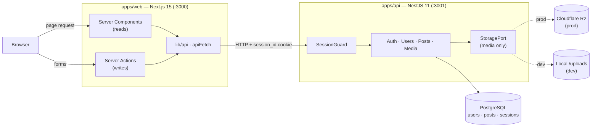

# Project Euphrat

An editorial blog platform for long-form writing. Multiple authors draft,
schedule, and publish posts through a dashboard; readers browse the
archive by category and author.

The project is under active development and is published here as a
portfolio reference, not as a deployable product.

---

## Architecture

The browser only talks to Next.js. The web app forwards reads (Server
Components) and writes (Server Actions) to the NestJS API through a single
`apiFetch` wrapper, attaching the `session_id` cookie that `SessionGuard`
validates on every protected request. The backend is a plain modular
monolith — the one place ports/adapters earn their keep is `MediaModule`,
which swaps between Cloudflare R2 (production) and a local-disk adapter
(development) at module composition time.

---

## Stack

| Layer            | Choice                                              |
| ---------------- | --------------------------------------------------- |
| API              | NestJS 11 (Express)                                 |
| Web              | Next.js 15 (App Router, Turbopack)                  |
| UI               | React 19, Tailwind CSS v4, Framer Motion            |
| Database         | PostgreSQL via Prisma 6                             |
| Content format   | TipTap (ProseMirror JSON)                           |
| Media storage    | Cloudflare R2 (S3 SDK) with a local-disk fallback   |
| Auth             | argon2 password hash + DB-backed session cookie     |
| Monorepo         | Turborepo + pnpm workspaces                         |

---

## Layout

    apps/
      api/                # NestJS — auth, users, posts, media
      web/                # Next.js — public site + author dashboard
    packages/
      content-schema/     # TipTap schema shared by both apps
      shared-types/       # Cross-app TypeScript types
      eslint-config/      # Shared lint config (typescript-eslint, Next)
      tsconfig/           # base / nextjs / nestjs tsconfig presets

---

## Domain

Three persistent models — `User`, `Post`, `Session` — and one explicit
state machine for the editorial workflow:

    draft  ⇄  scheduled  →  published  →  archived  →  draft
       └────────────────→  published

Two roles, `author` and `admin`. Authors act on their own posts; admins
see the full set. Six fixed categories: `ai`, `tech`, `philosophy`,
`sociology`, `politics`, `history`.

---

## HTTP surface

NestJS API, default port `3001`.

**`/auth`** — `POST /register`, `POST /login`, `POST /logout`

**`/users`** — `GET /me`, `PATCH /me`, `PATCH /me/password`, `GET /:id/public`

**`/posts`**
- Public: `GET /public`, `GET /public/archive`, `GET /public/random-featured`,
  `GET /public/:id`, `GET /public/category/:category`
- Dashboard: `GET /dashboard`, `GET /dashboard/:id`, `POST /`, `PATCH /:id`,
  `PATCH /:id/{publish,schedule,archive,revert}`, `POST /:id/cover`

**`/media`** — `POST /upload`

Protected routes require a `session_id` cookie; a global guard validates
the row in the `sessions` table and attaches `userId` to the request.

---

## Web routes

Next.js App Router, default port `3000`.

Public: `/`, `/archive`, `/posts/[id]`, `/posts/category/[category]`,
`/authors/[id]`, `/login`, `/register`.

Author dashboard (`/dashboard`): post list with status filter, create
and edit post, profile.

The home and category pages are composed of per-category "scenes" —
small Framer Motion compositions (philosophy, tech, history, sociology,
politics, AI) that give each section a distinct visual identity instead
of a generic card grid.

---

## Getting started

Requirements: Node 20+ (see `.nvmrc`), pnpm 9.15+, PostgreSQL 15+.

    git clone https://github.com/saddeg21/project-euphrat.git
    cd project-euphrat
    pnpm install

    cp apps/api/.env.example apps/api/.env       # fill in DATABASE_URL etc.
    cp apps/web/.env.example apps/web/.env

    pnpm --filter @euphrat/api prisma migrate dev
    pnpm dev

Common commands — Prisma, builds, workspace filters — live in
[`SCRIPTS.md`](./SCRIPTS.md).

---

## Notable implementation details

- **Server-side TipTap rendering.** The API installs JSDOM globals
  before bootstrapping Nest so TipTap's `generateHTML` can run during
  excerpt and preview generation. The JSDOM import must stay first in
  `apps/api/src/main.ts`.
- **Storage as a port.** The media module selects between an R2 adapter
  (AWS S3 SDK against a Cloudflare R2 bucket) and a local-disk adapter
  (writes to `apps/api/uploads/`, served from `/uploads`) at module
  composition time, based on environment.
- **Shared content schema.** Both apps consume the same TipTap schema
  from `@euphrat/content-schema`, so the document shape is a contract
  rather than a coincidence. Backend renders previews; frontend hosts
  the editor.
- **Server Actions for mutations.** The web app does not call the API
  from the browser for writes; mutations flow through Next.js Server
  Actions, which forward the session cookie to the API server-side.
- **Per-route auth gating.** There is no `middleware.ts`; protected
  pages read the session cookie via `lib/session.ts` inside the route
  itself. Per-route control was chosen over a single gate to keep
  redirect rules local to the page they protect.

---

## License

Proprietary. Source-available for viewing only; no rights granted for
use, modification, or redistribution. See [LICENSE](./LICENSE).

© 2026 Ahmet Deniz Dastan.
